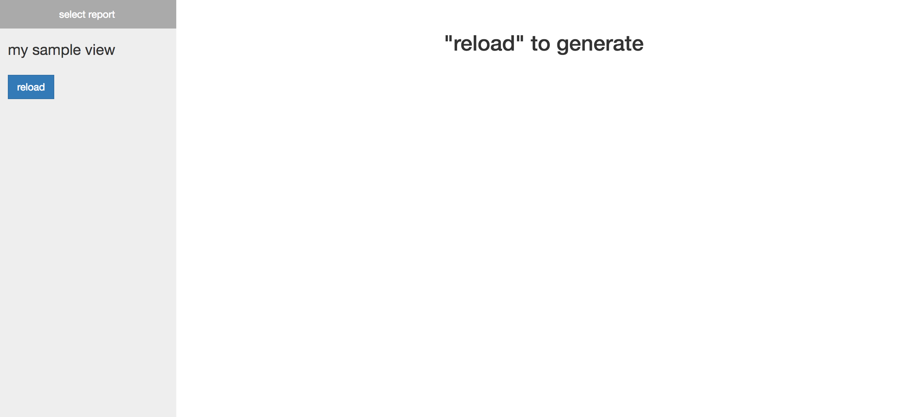

User's Guide
*************

If you are restless, you can see the `demo server <https://fizznow.com>`_ and the Jumbo Example section. Otherwise, here are the instructions:

Setup
============

This library requires Python 3. Assuming you already have Python 3 and pip installed, you can setup your project like this::

    $ mkdir myproj
    $ cd myproj
    $ python3 -m venv myvenv
    $ source myvenv/bin/activate
    $ pip install diva

The command ``python3 -m venv myvenv`` creates a directory called ``myvenv`` to handle your project's virtual environment. A virtual environment is a mechanism that gives the illusion (hence "virtual") that your project's version of the Python interpreter and any required libraries are installed locally. This isolates your project from other projects that may use different versions of Python (and thus different library versions). Virtual environments prevent conflicts of the form: Project A uses Python 2 and Project B uses Python3, and both depend on ``somelibrary``, which is installed globally. Project A is broken because it thinks it should use the latest installed version of ``somelibrary``, which only works for Python 3.

When you start working on your project, you must activate the environment with ``$ source myenv/bin/activate`` (which should prepend the environment name to your prompt like ``(myvenv) ... $``), and you should deactivate it when you're done using ``$ deactivate``.

Introduction
=============

Let's start with a minimal example:

.. literalinclude:: ../examples/minimal_example.py

You can run the example like::

    $ python3 minimal_example.py
    * Running on http://127.0.0.1:5000/ (Press Ctrl+C to quit)
    ...

Going to the given address in your browser should display:

You should be able to change the report, and play with the widget values.

.. image:: images/example_screenshot_b.png

First, we create a ``Diva`` object. Next, we use python's `decorator syntax <https://realpython.com/blog/python/primer-on-python-decorators/>`_ to register our analytics functions ``foo`` and ``bar`` with our ``Diva`` object. The ``view`` decorator *does not modify the underlying function* (``view`` just stores a reference to it in the ``Diva`` object). You can call ``foo`` or ``bar`` elsewhere in your code as if you weren't using diva at all. Finally, we call ``app.run()``, which serves the website linked above. The site contains a report for every function we register with our ``Diva`` object.

You can pass a list of widgets to ``view``. The ``bar`` function takes an integer and a float, so we pass the ``Int`` and ``Float`` objects to ``view``. As you can see, the webserver generates appropriate HTML widgets. When we reload the ``bar`` report, the values of these widgets are sent to the server, passed to ``bar``, and the result of ``bar`` is sent back to the browser (converted to HTML).

Basic API
==========

.. function:: Diva()
    
    This internally creates ``self.server``, a Flask object, which is is started by ``run``. More complex uses of Diva may require directly modifying this Flask object.

.. function:: Diva.view(name, widgets=[], short=None)
    
    Meant to be used with decorator syntax. ``name`` is what the view will be called in the web interface. ``widgets`` is an optionally empty list of ``diva.widgets.Widget`` objects. ``short`` allows you to give a short name that you can use to refer to the report later (see ``compose_view``). It will be set to ``name`` by default. Please see the Widgets section for a list of available widgets and what values they pass to the underlying function. Intuitively, the widget values are passed to the function in the order that the widgets appear in the list. If your function takes ``**kwargs``, you must suffer this mild inconvenience:

    .. literalinclude:: ../examples/other_examples.py
        :pyobject: baz

    .. literalinclude:: ../examples/other_examples.py
        :pyobject: baz_shim

.. function:: Diva.compose_view(name, view_names, layout=None, short=None)

    Creates a view by composing existing views. ``name`` is the name of the new view, ``view_names`` is a list of names (its ``short`` name if one is given, otherwise its UI ``name``) of the desired reports, ``layout`` is a Dashboard layout (please see the Dashboard section), and ``short`` is a short name to give to the newly created report (this works the same as ``short`` from ``view``). Note that this function can only be called after you've registered all of the views named in ``view_names``.
            
.. function:: Diva.run(host=None, port=None, debug=None, **options)

    ``run`` internally looks like this::
        
        # self.server is a Flask object
        self.server.run(host, port, debug, **options)

    Please see the `Flask documentation <http://flask.pocoo.org/docs/0.12/api/>`_ for an explanation of ``run``'s arguments. Briefly, setting ``debug=True`` will open an interactive debugger when an exception occurs, and also attempt to reload the server when the code changes.

    .. warning::
        
        The interactive debugger allows one to run arbitrary Python code on your server, so don't use ``debug=True`` on a publically accessable site.

    .. warning::

        If you want to make your diva app production ready, follow `these steps <http://flask.pocoo.org/docs/0.12/deploying/#deployment>`_ to make the underlying Flask server production ready. Also see the Security section below.

.. function:: Diva.__call__(environ, start_response)

    This is likely only relevant to you if you'd like to deploy the server, in which case you should first read an article on WSGI servers and also refer to `Flask's documentation <http://flask.pocoo.org/docs/0.12/deploying/#deployment>`_. The ``Diva`` object is callable as a WSGI entry point. It simply passes the args to the Flask server's (``self.server``) WSGI entry point and returns the result. Please see the source directory ``diva/examples/demo_server`` for an example.

Widgets
========

The built-in widgets (available via ``from diva.widgets import *``) are:

* String
* Float
* Int
* Bool
* SelectOne
* SelectSubset
* Color
* Slider
* Date
* DateRange
* Time

You can see each widget in action on the `demo server <https://fizznow.com>`_. The first argument passed to every widget constructor is the description of the widget in the web interface (such as, "choose a scale"). 

.. automodule:: diva.widgets
    :members:

Converters
===========

Diva attempts to convert the return value of your functions to HTML. The following conversions are supported:

* string: the string is assumed to be HTML.
* Dashboard: a diva.Dashboard object, see the Dashboard section below
* matplotlib.figure.Figure (using the mpld3 library)
* pandas.DataFrame & pandas.Series
* bokeh.plotting.figure.Figure
* *other*: the value is converted to a string and wrapped in HTML

You can see an example of each conversion on the `demo server <https://fizznow.com>`_. Conversion internally uses the `single dispatch decorator from functools <https://docs.python.org/3/library/functools.html>`_, so you can add your own converter like this:

.. literalinclude:: ../examples/custom_converter.py

Dashboards
===========

The ``diva.Dashboard`` class and the ``diva.compose_view`` function allow you to create views that arrange plots, tables, etc. in a grid layout. 

.. function:: diva.Dashboard(convertable_list, layout=None)::

    ``convertable_list`` is a list of objects that can be converted to HTML (see the Converters section), such as ``[my_figure, my_table, my_custom_html]`` (you can even include other Dashboard objects). ``layout`` specifies how the items are sized and positioned in the grid. The most convenient way to create a layout is with ``diva.row_layout``.

.. function:: diva.row_layout(*num_columns)::

    The ith integer given is the number of items to place in row i. Returns a layout compatible with ``Dashboard`` and ``compose_view``. Examples: ``row_layout(1, 1, 1)`` creates a 3-row layout where there is one item per row. ``row_layout(1, 2)`` creates a 2-row layout where there is one item in the first row and two items in the second row (placed side by side, with the row divided in half). 

If ``row_layout`` is not enough, you can manually specify the ``layout`` argument. It is a list of ``[top_left_x, top_left_y, width, height]`` lists. For a 10 by 10 grid container, the top-left corner is (0, 0) and the bottom-right is (10, 10). For example, ``[0, 1, 2, 3]`` occupies the grid space from (0, 1) to (2, 4) on the grid. When giving your list of panes, you can imagine that your grid is any size you want. It doesn't matter because it is scaled to fit its parent div in HTML. For example, layouts ``[[0, 0, 1, 1], [1, 0, 1, 1]]`` and ``[[0, 0, 2, 2], [2, 0, 2, 2]]`` both give a vertically split layout. The first one is not smaller than the second. Note that ``row_layout(2)`` returns this same layout.  

.. literalinclude:: ../examples/dashboard_example.py

Utilities
==========

Depending on the type that your function returns, utility buttons may be added to the sidebar. If your view function returns a pandas DataFrame, for example, a button will appear in the widgets sidebar allowing you to export it to a .csv file. You can add utilities like this:

.. literalinclude:: ../examples/custom_utility.py

As shown in the example, utilities must return the result of a call to ``file_response``. This triggers a file download on the client side.

.. autofunction:: diva.utilities.register_widget_util

.. autofunction:: diva.utilities.register_simple_util

.. autofunction:: diva.utilities.file_response

Security
=========

**Input Sanitation**

If you are allowing public access to your site, you are responsible for sanitizing user input. Diva performs some trivial sanitation, like ensuring the value of a string widget is actually passed to your function as a string and not an int. However, if your underlying functions are accessing sensitive information, be careful.

**Password Protection**

Diva currently doesn't support password management. It may support simple password protection in the future, but likely not a full user access system. 

However, you can modify the underlying Flask object to add your authentication code like this::

    app = Diva()

    # create some views like normal

    flask_server = app.server

    # Modify flask_server to add your auth code

    # this is the same as flask_server.run()
    app.run()

You can modify the Flask object's view functions (`docs here <http://flask.pocoo.org/docs/0.12/api/>`_) to add your auth code. See the function ``setup_server`` from the diva source file ``diva/diva/reporter.py`` to see what endpoints diva uses.

If that doesn't work, things get more complex. Suppose you already have a publically accessible server with a user management system. Perhaps it isn't written in python. You could run diva as a local server (not publically exposed, that is), and setup a password-protected endpoint in your public server that acts as a reverse proxy between your public server and the diva server.

Jumbo Example
================ 

.. literalinclude:: ../examples/jumbo_example.py

Alternatives
=============

Jupyter has its own widget library, and `you can interact with functions like this <http://ipywidgets.readthedocs.io/en/latest/examples/Using%20Interact.html>`_. To share a Jupyter notebook, you can archive the .ipynb file in your GitHub, then use the tools nbviewer or mybinder to give others access to your notebook. You can also take a look at `IPython Dashboards <https://github.com/litaotao/IPython-Dashboard>`_. 

